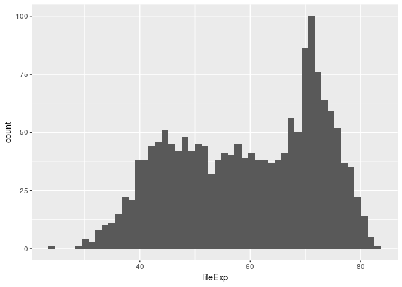
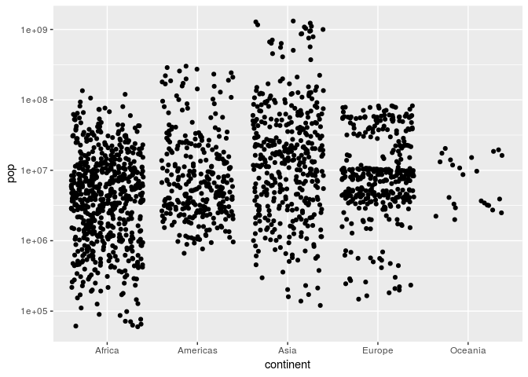
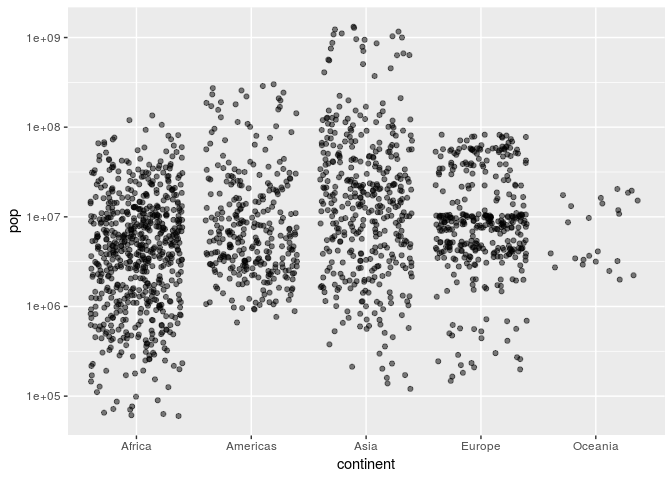
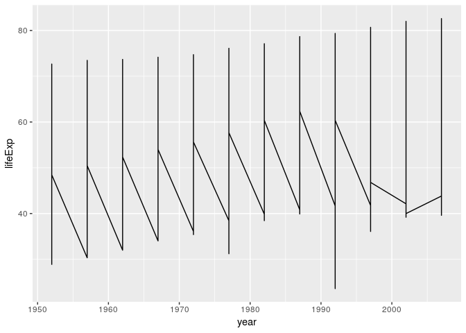

cm006 Exercises: Exploring Geometric Objects
================

**Plotting in R**
-----------------

-   base R (came with R)
-   lattice
-   ggplot2 (an R package)
    -   Part of the tidyverse

When using ggplot2 for generating figure, one most specific the following things:

-   Data
-   Aesthetic mapping (horizontal axis, vertical axis, ...)
-   Geometric objects

The ggplot2 **ggplot() **qplot()

In this worksheet, we'll be exploring various plot types (i.e., geometric objects), only using the `x` and `y` aesthetics (and `group`).

1.  To get started, load the `tidyverse` and `gapminder` R packages.

``` r
library(tidyverse)
```

    ## Warning: replacing previous import by 'tibble::as_tibble' when loading
    ## 'broom'

    ## Warning: replacing previous import by 'tibble::tibble' when loading 'broom'

    ## ── Attaching packages ────────────────────────────────── tidyverse 1.2.1 ──

    ## ✔ ggplot2 3.0.0     ✔ purrr   0.2.5
    ## ✔ tibble  1.4.2     ✔ dplyr   0.7.6
    ## ✔ tidyr   0.8.1     ✔ stringr 1.3.1
    ## ✔ readr   1.1.1     ✔ forcats 0.3.0

    ## ── Conflicts ───────────────────────────────────── tidyverse_conflicts() ──
    ## ✖ dplyr::filter() masks stats::filter()
    ## ✖ dplyr::lag()    masks stats::lag()

``` r
library(gapminder)
```

Scatterplot
-----------

Let's look at a *scatterplot* of `gdpPercap` vs. `lifeExp`.

1.  Fill out the grammar components below. Again, bold *must* be specified to make a `ggplot2` plot.
    -   We'll ignore "coordinate system" and "facetting" after this.

| Grammar Component     | Specification |
|-----------------------|---------------|
| **data**              | `gapminder`   |
| **aesthetic mapping** | `x` and `y`   |
| **geometric object**  | point         |
| scale                 | linear        |
| statistical transform | none          |
| coordinate system     | rectangular   |
| facetting             | none          |

1.  Populate the data and aesthetic mapping in `ggplot`. What is returned? What's missing?

``` r
ggplot(gapminder,aes(x=lifeExp,y=gdpPercap))
```


1.  Add the missing component as a *layer*.

``` r
ggplot(gapminder,aes(x=lifeExp,y=gdpPercap))+ geom_point()
```


Notice the "metaprogramming" again!

1.  You *must* remember to put the aesthetic mappings in the `aes` function! What happens if you forget?

2.  Put the x-axis on a log scale, first by transforming the x variable.
    -   Note: `ggplot2` does some data wrangling and computations itself! We don't always have to modify the data frame.

``` r
ggplot(gapminder,aes(x=lifeExp,y=log(gdpPercap))) +
        geom_point()
```


1.  Try again, this time by changing the *scale* (this way is better).

``` r
ggplot(gapminder,aes(x=lifeExp,y=gdpPercap))+ 
  geom_point() + 
  scale_y_log10()
```


Inter-changing the order of **scale** and **geom\_point**

``` r
ggplot(gapminder,aes(x=lifeExp,y=gdpPercap))+ 
  scale_y_log10() +
  geom_point() 
```


1.  The aesthetic mappings can be specified on the geom layer if you want, instead of the main `ggplot` call. Give it a try:

``` r
ggplot(gapminder) + geom_point(aes(x=lifeExp,y=gdpPercap))
```


1.  Optional: git stage and commit

**Uses of a scatterplot**:

-   Visualize 2-dimensional distributions; dependence.
-   2 numeric variables

Histograms, and Kernel Density Plots
------------------------------------

Let's build a histogram of life expectancy.

1.  Fill out the grammar components below. Again, bold *must* be specified to make a `ggplot2` plot.

| Grammar Component     | Specification |
|-----------------------|---------------|
| **data**              | `gapminder`   |
| **aesthetic mapping** | `x`           |
| **geometric object**  | histogram     |
| scale                 | linear        |
| statistical transform | none          |

1.  Build the histogram of life expectancy.

``` r
ggplot(gapminder, aes(lifeExp)) +
  geom_histogram()
```

    ## `stat_bin()` using `bins = 30`. Pick better value with `binwidth`.


1.  Change the number of bins to 50.

``` r
ggplot(gapminder, aes(lifeExp)) +
  geom_histogram(bins=50)
```



1.  Instead of a histogram, let's create a kernel density plot.

``` r
ggplot(gapminder, aes(lifeExp)) + 
  geom_density()
```


``` r
ggplot(gapminder, aes(lifeExp)) + 
  geom_density(fill = "blue")
```


``` r
ggplot(gapminder, aes(lifeExp)) + 
  geom_density(bw=0.1)
```


``` r
ggplot(gapminder, aes(lifeExp)) +
  geom_histogram(aes(y=..density..)) +
  geom_density(fill='green')
```

    ## `stat_bin()` using `bins = 30`. Pick better value with `binwidth`.


``` r
ggplot(gapminder, aes(lifeExp)) +
  geom_density(fill='green') +
  geom_histogram(aes(y=..density..), fill='orange') 
```

    ## `stat_bin()` using `bins = 30`. Pick better value with `binwidth`.

 5. Optional: git stage and commit

**Uses of a histogram**: Explore the distribution of a single numeric variable.

Box plots, and violin plots
---------------------------

Let's make *box plots* of population for each continent. Note: y-axis is much better on a log scale!

1.  Fill out the grammar components below. Again, bold *must* be specified to make a `ggplot2` plot.

| Grammar Component     | Specification    |
|-----------------------|------------------|
| **data**              | `gapminder`      |
| **aesthetic mapping** | `x` and `y`      |
| **geometric object**  | boxplot          |
| scale                 | log-y            |
| statistical transform | 5-number summary |

1.  Initiate the `ggplot` call, with the log y scale, and store it in the variable `a`. Print out `a`.

``` r
A <- ggplot(gapminder, aes(continent,pop)) +
    scale_y_log10()
```

1.  Add the boxplot geom to `a`.

``` r
A + 
  geom_boxplot()
```


``` r
A + 
  geom_boxplot(fill = 'red')
```


1.  A violin plot is a kernel density on its side, made symmetric. Add that geom to `a`.
    -   What's better here, boxplots or violin plots? Why?

``` r
A + geom_violin(fill='green')
```


This gives us more information about the data. The thickness show the density of data with each value.

1.  Optional: git stage and commit

**Use of boxplot**: Visualize 1-dimensional distributions (of a single numeric variable).

Jitter plots
------------

Let's work up to the concept of a *jitter plot*. As above, let's explore the population for each continent, but using points (again, with the y-axis on a log scale).

Let's hold off on identifying the grammar.

1.  Initiate the `ggplot` call to make a scatterplot of `continent` vs `pop`; initiate the log y scale. Store the call in the variable `b`.

``` r
A + geom_point()
```


``` r
A + geom_point(alpha=0.1)
```

 The thickness shows the density.

1.  Add the point geom to `b`. Why is this an ineffective plot?

2.  A solution is to jitter the points. Add the jitter geom. Re-run the command a few times -- does the plot change? Why?

``` r
A + geom_jitter()
```



``` r
A + geom_jitter(alpha = 0.5)
```



``` r
head(gapminder)
```

    ## # A tibble: 6 x 6
    ##   country     continent  year lifeExp      pop gdpPercap
    ##   <fct>       <fct>     <int>   <dbl>    <int>     <dbl>
    ## 1 Afghanistan Asia       1952    28.8  8425333      779.
    ## 2 Afghanistan Asia       1957    30.3  9240934      821.
    ## 3 Afghanistan Asia       1962    32.0 10267083      853.
    ## 4 Afghanistan Asia       1967    34.0 11537966      836.
    ## 5 Afghanistan Asia       1972    36.1 13079460      740.
    ## 6 Afghanistan Asia       1977    38.4 14880372      786.

1.  How does the grammar differ from a box plot or violin plot?
    -   ANSWER:

``` r
A + geom_violin(fill = 'green') + geom_jitter(alpha = 0.25, fill = 'red')
```


1.  We can add multiple geom *layers* to our plot. Put a jitterplot overtop of the violin plot, starting with our base `b`. Try vice-versa.

2.  Optional: git stage and commit

**Uses of jitterplot**: Visualize 1-dimensional distributions, AND get a sense of the sample size.

Time/Line Plots
---------------

Let's make some time/line plot, starting with Canada's life expectancy over time.

1.  Fill out the grammar components below. Again, bold *must* be specified to make a `ggplot2` plot.

| Grammar Component     | Specification |
|-----------------------|---------------|
| **data**              | `gapminder`   |
| **aesthetic mapping** |               |
| **geometric object**  |               |
| scale                 |               |
| statistical transform |               |

1.  In one readable call, write code that:
    1.  Filters the data to Canada only
    2.  Pipes the filtered data into `ggplot`
    3.  Makes the time plot of `lifeExp` over time
    4.  Also displays the points

``` r
gapminder %>%
  filter(country == "Canada") %>%
     ggplot(aes(year,lifeExp)) + 
       geom_line() + 
        geom_point()
```


1.  Attempt to overlay line plots for all countries. That is, repeat the above code, but don't filter. What's wrong here?

``` r
ggplot(gapminder, aes(year, lifeExp)) + geom_line()
```


``` r
c <- ggplot(gapminder, aes(year, lifeExp)) 
c + geom_line()
```



``` r
c + geom_line(aes(group=country), alpha= 0.2)
```


1.  Use the `group` aesthetic to fix the problem.

2.  Optional: git stage and commit

**Uses of time/line plots**: Visualize trends of a numeric variable over time.

Path plots
----------

Let's see how Rwanda's life expectancy and GDP per capita have evolved over time, using a path plot.

1.  Make a scatterplot. Store it in the variable `c`.

2.  We want to connect the dots from earliest point to latest. What happens if we add the "line" geom to `c`?

3.  Add the appropriate geom to `c`. In that geom, specify a property of the geom: `arrow=arrow()`.

4.  Optional: git stage and commit

**Uses of path plots**: The four "corners" of the plot usually indicate different qualities. This plot allows you to see how Rwanda (or some entity) evolves over these qualities.

Bar plots
---------

How many countries are in each continent? Use the year 2007.

1.  Fill out the grammar components below. Again, bold *must* be specified to make a `ggplot2` plot.

| Grammar Component     | Specification |
|-----------------------|---------------|
| **data**              | `gapminder`   |
| **aesthetic mapping** |               |
| **geometric object**  |               |
| scale                 |               |
| statistical transform |               |

1.  After filtering the gapminder data to 2007, make a bar chart of the number of countries in each continent. Store everything except the geom in the variable `d`.

2.  Notice the y-axis. Oddly, `ggplot2` doesn't make it obvious how to change to proportion. Try adding a `y` aesthetic: `y=..count../sum(..count..)`.

3.  Optional: git stage, commit, and push!

**Uses of bar plots**: Get a sense of relative quantities of categories, or see the probability mass function of a categorical random variable.
